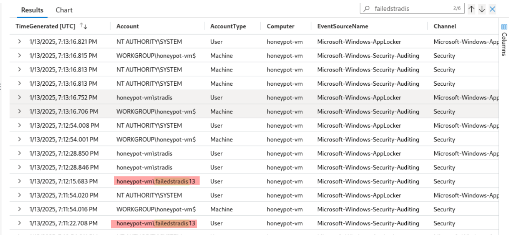
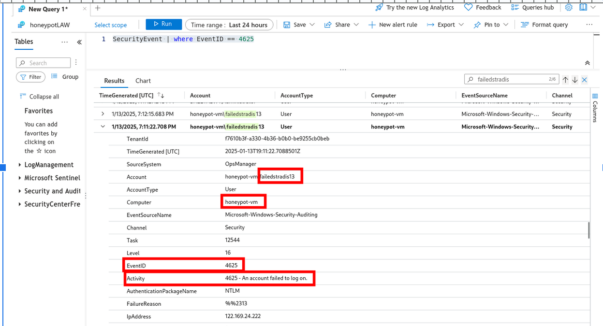

# Azure-CloudBased-SIEM
This project demonstrates a simulated vulnerable Azure VM environment to showcase how Azure Sentinel, Microsoft’s cloud-native SIEM, detects and visualizes potential attacker activity.


- We have set up an Azure Subscription with **a publicly exposed Virtual Machine** (firewalls have been disabled for simulation)
- The attack requests are logged (in Powershell) and then ingested into **Azure Log Analytics Workspace.**
- Leveraged **Azure Sentinel** to map and monitor the requests being generated geographically.
- This helps visualise attacker behavior on a real-time dashboard, including **geolocation-based threat detection**.


### Features of SIEM:
- Configure alerts based on specific threat conditions or patterns.

- Ingest failed login data into Azure Sentinel to visualize attack origins and identify malicious activity by geographic location.


### Geographical Location Identification:

- Normally, logs in Windows machine are fetched from `Event Viewer`.
    
- However, when those logs are extracted, we don't have any details related to the "location" i.e., _where are the requests being made from?_.

- So, using a 3rd party API - `https://ipgeolocation.io/` and custom script , we fetch the location details for the associated log.


### Implementation

- After the Azure VM is configured with Azure Sentinel, we connect to the VM via RDP. 
- As different users try to login to the windows VM, the `failed activity` gets logged. Viweing those logs in the `Event Viewer` =>


- Designed a custom script to use the IP address (from Event Viewer Log) and external 3rd party API to fetch the latitude/longitude details.


### Log Analysis - Azure Log Analytics Workspace
- Performed Log Analysis on the fetched logs from failed login attempts as shown below :




- Using custom Log filtering query, fetched the latitude and longitude details to view the results on Dashboard.

#### Sample Log 
```
latitude:54.89029,longitude:23.92775,destinationhost:honeypot-vm,username:Administrator,sourcehost:91.238.181.31,state:Kauno Apskritis, country:Lithuania,label:Lithuania - 91.238.181.31,timestamp:2025-01-13 21:23:46
```

### Final Results

